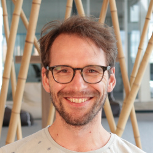

### Who am I?
------

I am a passionate developer who likes to participate in sports in the weekends
(have an excuse to drink beer on the terrace with friends after exercising).
I have 2 kids, I like games, and am always in for a match of *foosball*.
Direct communication with respect for one another works the best for me, and
I prefer autonomy over micromanagement.

I love to cook and bake. Disclaimer: I am not a chef, but it gives me _Zen_.
Maybe in an afterlife I will open my own bakery, but for now sourdough bread (and baking) really got
me. I made with my own starter and try to bake at least one bread a week (so far I am holding up).

### Personalia
------

*  **Dutch** (native), **English** (good)
*  May 1st, 1983
*  Utrecht Area, The Netherlands
*  <a href="mailto:hwdegroot@gmail.com">hwdegroot@gmail.com</a>
*  [rikhwdegroot](https://www.linkedin.com/in/rikhwdegroot/)
*  [*@hwdegroot*](https://twitter.com/hwdegroot)
* CM [*@hwdegroot*](https://www.codementor.io/m-badges/hwdegroot/im-a-cm-g.svg)
*  [forsure.dev](https://www.forsure.dev)
*  Male

### Profile
------

I am a passionate developer with a focus on operations, who loves (new, current and old) technology.
But most of all I like tools to get the job done.
In my career I started as a tester. I always had a keen interest for programming
and automating processes.
I do not like to repeat myself, which drills down to: scripting processes when I do it for the second time.
As a result I shifted from tester with affinity for automating to developer (with affinity for
continuous integration).

Throughout the years I have gained an extensive background in the full life-cycle of software development process
(also in a regulated environment according to IEC 62304), including design, development, quality cycle, release and maintenance.
I believe that I am (or at least should be) responsible for what I made (replace I with team), and _You build it, you own it!_.
I see myself as a code critic, on self-written code, but also code written by others.

I like to keep developing myself, and am an autodidact with a _can-do_ mentality. This makes me a driver in teams.
In the role as scrum master I try to facilitate the team coming up with the best solution for the problem, instead of
executing a plan thought of by someone else telling teams what to do (autonomy over micromanagement). For me strict
hierarchical organizational structures will not get the best out of me.

### Experience
------

#### easee

**Scrum master** - *February 2020 - now*

As a Scrum master my main focus is supporting the development team,
enabling the daily stand-ups and facilitating retrospectives are two of the main tasks.
I introduced working according to SCRUM and working in sprints. Together with the
Product Owner we started the weekly company demo's where the RnD team demos the work
that was accomplished during the week.

**Senior Software Engineer**  - *October 2017 - now*

At easee we create an online eye exam. Because the device has a measuring function we are classified
as a MDD 93/42/EEC medical device class I with measuring function (also known as class Im). Together with
the RnD team, ISO 13485 Quality Management Systems was implemented and certified by TÜV Rheinland.
Working in a regulated environment requires a different approach which can be challenging in its own way,
changes are stricter and more controlled than in other fields of the profession, but this will challenge a
different mindset.
My role, more specifically, has focus on the development and operations of the application.

The application itself is a php/laravel and VueJS/python application. The architecture is hosted on AWS.

_Key achievements and responsibilities_

* Application production ready and scalable
* Process automation (CI, test framework, release)
* Process guards (Code reviews, tests, sprints)
* Introduced SCRUM

#### Mendix

At mendix I started working as a testengineer. In this role I made the desktop application
more testable by exposing form elements, so they can be detected by `Windows.Automation` framework.

At the time the application build at mendix consisted of many repositories, that were all bundled
and tested with CI. I started optimizing this process and became owner of these processes and architecture.
First alone, later the team grew.

**Developer (Ops)**  - *January 2017 - September 2017*

_Key achievements and responsibilities_

 * Setting up and scripting deployment pipelines and automating release process and pipelines.
 * Build realtime monitoring dashboard with build status and awareness of the shippability in React/typescript on top of Jenkins API
 * Supporting teams with their CI/CD process and the implementation of build pipelines and git hooks.

**Test Engineer** - *November 2014 - December 2016*

_Key achievements and responsibilities_

* Setting up and scripting deployment pipelines and automating release process.
* Automating quality processes and setting up UI test framework.

#### NetInvent

**C# Developer** - *January 2014 - October 2014*

Lead several projects as a consultant. Successfully delivered (html) applications for customers in
different domains (government, music industries). Implementing C#.NET webapplications (C#.NET, Code First).

#### ExpertDoc

**QA Manager** - *January 2013 - December 2014*

ExpertDoc makes a decision support system for first line medical professionals (GP). At the time companies
that create standalone Medical Device Software, have to adhere to the MDD as well.

At first, the focus of my work was on implementing and maintaining the decision trees for the supported domains
in the tool Gaston from Medecs BV.
Later, when the QMS was to be implemented in scope of MDD/93/42/EEC my role shifted to QA/RA officer, as I was
in charge of the implementation of the QMS.

_Key achievements and responsibilities_

* Implementation of guideline MDD/93/42/EEC (software as a medical device) processes and certification.
* Introduced and implemented workflows for the QMS in Microsoft Sharepoint.
* Implementing domain decision trees

### Skills
------

#### **Regulation**

Familiar with working in regulated environments (Medical device software) according to and with the
following standards:

* **ISO 13485** - Medical Devices — Quality Management Systems
* **ISO 14971** - Medical devices — Application of risk management to medical devices
* **IEC 62366-1** - Medical Devices — Usability Engineering
* **IEC 62304** - Medical Device Software — Software life cycle processes

#### **Programming**

I prefer using the language that will get the job done, over using it for the sake of using the language.
I like to peek around in new languages. My most recent interest is functional programming (Haskell).
During my studies at University I got in touch with C++. I still think it is one of the coolest programming languages around. But I am not afraid to write some pretty shell script to get a job done either.

> Why do easy things by hand in 90 minutes, when you could spend weeks coming up with a super complicated automatic solution that doesn't work that well?

This is really nice quote (with a good pun of course), that might be applicable to me every now and then from a
really cool blog post: http://tom7.org/lowercase/. Really worthwhile watching. It will cheer you up, trust me.
There is, however, some truth in this as well, because any developer will have a few of these totally overengineered
projects. On the other hand, these are great learning experiences as well. Just need to know when and when not to do
it.

There are lots of books written on haw to write good software. Any developer will tell you something different.
I like the [Joel Test](https://www.joelonsoftware.com/2000/08/09/the-joel-test-12-steps-to-better-code/). It is a simple list
that does not necessarily give you good software, if that even exists, but it will make writing bad code, and
have software that your users won't use less likely.

##### Tools

Git, Bash, Linux, C#, .NET, C++, Python, Vanilla JS, Vue, TypeScript

#### **Operations**

Very skilled with configuration management tools such as Ansible, Puppet and Chef Setting up (local)
environments using containerization with `docker`.

Skilled with AWS environments.

##### Tools

puppet, Ansible, AWS

#### **CI/CD**

_(continuous integration/continuous delivery)_ Scripting and maintaining release scripts and pipelines. Very clear view and idea about continuous delivery and deployment. Very experienced in setting up pipelines with `docker` and `docker-compose` and high availability clusters using orchestration tools such as `kubernetes`

##### Tools

Docker, Docker-compose, Python, bash, linux, Gitlab CI, Jenkins, Artifactory

#### **Release management**

I am very familiar with the processes to manage releases, using containerized pipelines, and orchestrating automated deployments.
Also, or especially, in regulated environments.

#### **Risk Management**

I am very familiar with risk assessment and risk management, especially according to ISO 14971. For most of the roles
I had I was involved in the risk management processes. Especially in my current role, where I am also part of the risk
management team, whose responsibility it is to guard the risk manangement processes.

##### Tools

Pen and paper

### Certificates
------

#### Boost your impact

* Date obtained: June 12, 2020
* Issuer: [FP&P](https://www.fpnp.nl/boost-your-impact-programma-voor-young-professionals/)

#### IEC 62304 Introduction course Online

* Date obtained: May 28, 2020
* Issuer: [Lorit Consultancy](https://lorit-consultancy.com/en/home/)

#### Mendix Apprentice

* Date obtained: January 2015
* Certificate id: 10663
* Issuer: [Mendix](https://mendix.com)
* Url: https://academy.mendix.com/index.html#1422606975083-2300

#### PSM I

* Date obtained: December 24, 2012
* Certificate id: 167692
* Issuer: [Scrum.org](https://www.scrum.org/)
* Url: https://www.scrum.org/certificates/167692
* Recipient email address (to view certificate): rik.degroot@expertdoc.nl

#### PRINCE2 Foundation

* Date obtained: October 2012
* Certificate id: 02360521-01-VEYW
* Issuer: [APMG International](https://apmg-international.com/)

#### TMap Test Professional

* Date obtained: September 2011
* Certificate id: 429661.984979
* Issuer: [Exin](https://www.exin.com/)

#### Radiation Health Physics Level 3

* Date obtained: April 2009
* Certificate id: 10122007-D39-3
* Issuer: [TU Delft](http://www.rid.tudelft.nl/en/cooperation/facilities/reactor-instituut-delft/radiation-protection-professional-education/health-physics-courses/)
* Url: http://www.rid.tudelft.nl/en/cooperation/facilities/reactor-instituut-delft/radiation-protection-professional-education/health-physics-courses/

### Education
------

#### **Biomedical Imaging Sciences**
* *MSc*
* Graduated in 2009

#### **Physics & Astronomy**
* *BSc*
* Graduated in 2007

#### **Veterinary Science**
* *Propedeuse*
* Graduated in 2002

